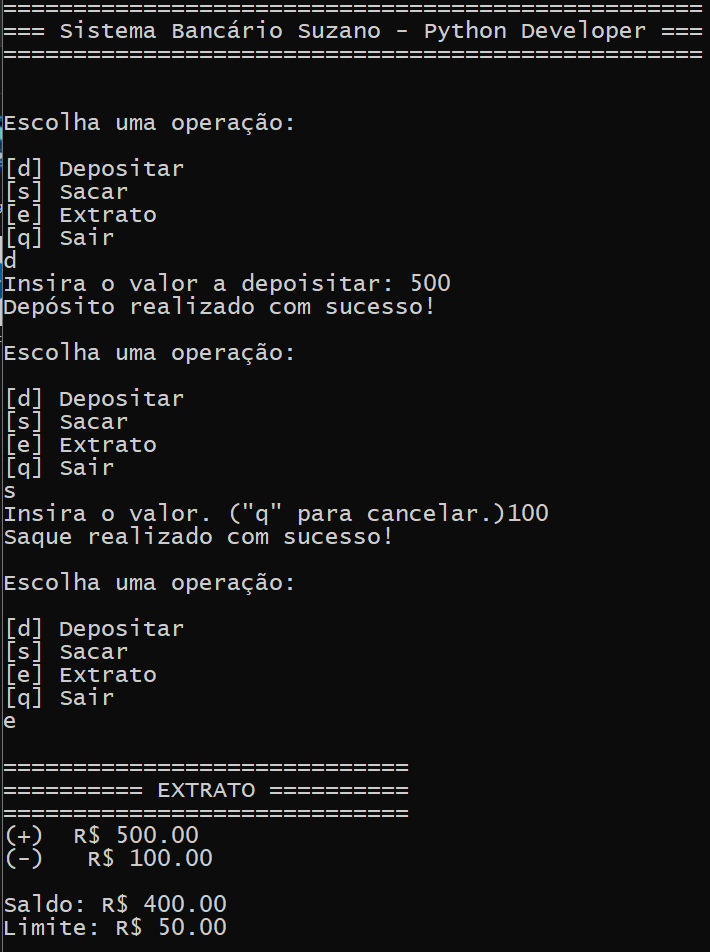

# Suzano - Python Developer

<div style="display:flex; flex-direction: column; align-items:center">


## mini_sistema_bacario

</div>
Um projeto para conclusão do módulo de `sintaxe básica de python`

### 👨🏽‍💻 O que é

Um sistema bancário que ao iniciara a aplicação surge um menu com as opções?
<ul style="list-style:none">
<li>[d] Depositar</li>
<li>[s] Sacar</li>
<li>[e] Extrato</li>
<li>[q] Sair</li>
</ul>

O usuário digita uma das opções e a função para executar a opção do usuário.

### 🛠️ Ambiente de desenvolvimento

- <span style="display:flex; align-itens: center; gap:8px">Python: ver. 3.13.3</span>
- <span style="display:flex; align-itens: center; gap:8px"> Windows 11</span>
- <span style="display:flex; align-itens: center; gap:8px"> PowerShell 7.2.24.0</span>
- <span style="display:flex; align-itens:center; gap:8px"> VsCode</span>

### Como usar

Clonar o respositório em um diretório local

```ssh
git clone git@github.com:guedesindev/mini_sistema_bacario.git
```

Executar o projeto

```ssh
cd mini_sistema_bacario
python sistema_bancario.py
```

### Tela do Projeto


