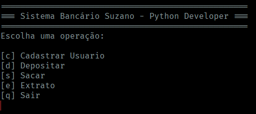

# Suzano - Python Developer

<div style="display:flex; flex-direction: column; align-items:center">


## mini_sistema_bancario

</div>
Um projeto para conclusão do módulo de `sintaxe básica de python`

### 👨🏽‍💻 O que é

Um sistema bancário que ao iniciar a aplicação surge um menu com as opções?

`[c]` Cadastrar Usuário<br>
`[d]` Depositar<br>
`[s]` Sacar<br>
`[e]` Extrato<br>
`[q]` Sair<br>

O usuário digita uma das opções e e o sistema executa a ação correspondente.

### 🛠️ Ambiente de desenvolvimento

<span style="display:flex; align-itens: center; gap:8px">    Python: ver. 3.13.3</span><br>
<span style="display:flex; align-itens: center; gap:8px">    Windows 11</span><br>
<span style="display:flex; align-itens: center; gap:8px">    PowerShell 7.2.24.0</span><br>
<span style="display:flex; align-itens:center; gap:8px">    VsCode</span><br>

### Como usar

Clonar o repositório em um diretório local

```ssh
git clone git@github.com:guedesindev/mini_sistema_bacario.git
```

Executar o projeto

```ssh
cd mini_sistema_bancario
python sistema_bancario.py
```

### Tela do Projeto

#### Menu Principal



### 🤝 Contribuindo

Fique à vontade para enviar sugestões ou melhorias! Esse projeto é uma jornada de aprendizado e toda colaboração é bem-vinda.

😉 Espero que você curtam a minha versão do desafio.
